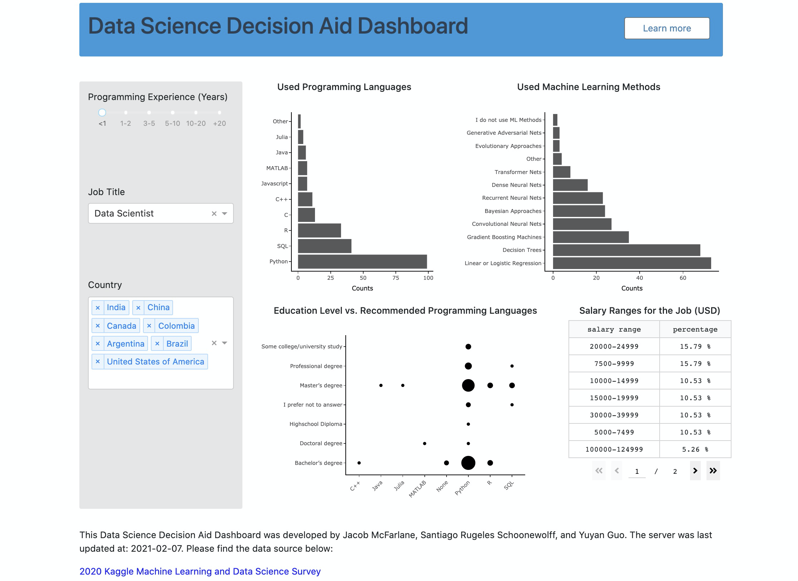

# Data Science Decision Aid Dashboard

## Heroku Link: https://careeraid-final.herokuapp.com/

## Welcome!

Welcome! Thank you for visiting the Data Science Decision Aid Dashboard app project repository.

This document (the README file) will guide you through our app and provide you the information for our project.

## Why are we designing this App?

Data science and computer science starts to get really popular in recent years. Such popularity attracts more people to join and even transfer into this field without knowing too much about it. In fact, data science and computer science is a very large and complex field with various career options, such as data analyst, soft engineer etc. Those different career choices can have completely different concentration and skill requirements. Therefore, we propose building a public available data visualization app to allow people to visually explore the current job market for data science and computer science in more details to differentiate between those occupations. We hope it can be helpful for anyone who is interested in looking for a job in data science, machine learning and computer science field!

## Overview of the App

This dashboard displays information about reported usage of machine learning approaches, salary and programming languages for different data science-related job titles at different levels of experience, and at different countries.

## Objective and Visualizations

The objective of this app is to provide some insight for those Data Scientists who are starting or engaging in their job searching process, by providing certain in-field distinctions between different job titles, experience gaps and other relevant features. These distinctions will include the expected yearly income in USD, the most common tools utilized in their field, as well as the average education level presented those job titles (along with which programming languages do people recommend to learn). Some graphs exposed as output include the average salaries per-year for the information provided  (a table), bar charts of the most common programming languages and machine learning methods associated with that title, and a fluctuation chart between the education level of the surveyed and their recommended programming languages to learn. Because this is a public app, it will be available to anyone interested in the topic, even if they are not part of the target audience (recruiters, teaching staff, etc.). 

## Structure and Interactivity

Across the top of our dashboard, a drop-down menu will allow our user to filter the data by given job title, programming experience and country. Structure wise, the app will include a slider to insert the experience gap they currently find themselves in (between 0 years to ten or more years). Moreover, in  dropdown menus, users will specify the job title they are interested in, and the country they currently inhabit. Upon opening the dashboard, no filtering will be applied so that the user can first examine the overall distribution of these preferences and garner more insight into what is a distinct skill specific to a given job title and what is more of an overarching skill for all data science-related professions. In reality, many job titles and their specific functions are considerably intertwined, hence, the usage of this dashboard could help a user identify key differences that align more with their profile. Interactive functions will be implemented, allowing the user to observe the exact count in the plots, if their understanding is being affected by the current presentation.

## Contact us

We'd love to hearing your feedback and suggestions! If you want to report a problem or suggest an enhancement we'd love for you to [open an issue](../../issues) at this github repository because then we can get right on it.

## Thank you

Thank you so much (Merci beaucoup!) for visiting the project and we do hope that the you'll enjoy reviewing the app and feel more clear what your career goal is!
